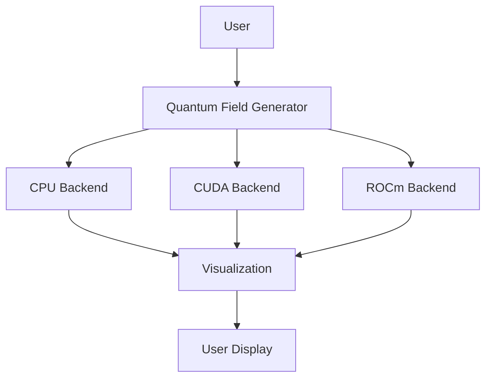

# Setting Up GitHub Pages Documentation

This guide explains how to create and deploy documentation for the Quantum Field Visualization library using GitHub Pages with MkDocs.

## Overview

GitHub Pages provides free hosting for project documentation directly from your GitHub repository. We'll use MkDocs with the Material theme to create beautiful, responsive documentation.

## Prerequisites

- GitHub repository for the project
- Python 3.8 or higher
- Basic knowledge of Markdown

## Step 1: Install MkDocs and the Material Theme

```bash
pip install mkdocs mkdocs-material
```

## Step 2: Configure MkDocs

Create an `mkdocs.yml` file in the root of your project:

```yaml
# Site information
site_name: Quantum Field Visualization
site_description: A Python package for generating and visualizing quantum fields based on phi-harmonic principles
site_author: Quantum Field Team
site_url: https://yourusername.github.io/quantum-field/

# Repository information
repo_name: yourusername/quantum-field
repo_url: https://github.com/yourusername/quantum-field
edit_uri: edit/main/docs/

# Copyright
copyright: Copyright &copy; 2025 Quantum Field Team

# Configuration
theme:
  name: material
  palette:
    primary: indigo
    accent: deep purple
  features:
    - navigation.instant
    - navigation.tracking
    - navigation.tabs
    - navigation.sections
    - navigation.expand
    - search.suggest
    - search.highlight
    - content.code.copy
    - content.code.annotate
  icon:
    repo: fontawesome/brands/github
  logo: assets/logo.png
  favicon: assets/favicon.ico

# Extra CSS
extra_css:
  - stylesheets/extra.css

# Extensions
markdown_extensions:
  - admonition
  - codehilite
  - footnotes
  - meta
  - toc:
      permalink: true
  - pymdownx.arithmatex:
      generic: true
  - pymdownx.highlight
  - pymdownx.superfences
  - pymdownx.tabbed:
      alternate_style: true
  - pymdownx.tasklist:
      custom_checkbox: true

# Plugins
plugins:
  - search
  - minify:
      minify_html: true

# Navigation structure
nav:
  - Home: index.md
  - Getting Started:
    - Installation: installation.md
    - Quick Start: quick-start.md
  - User Guide:
    - Basic Concepts: user-guide/basic-concepts.md
    - Field Generation: user-guide/field-generation.md
    - Field Analysis: user-guide/field-analysis.md
    - Visualization: user-guide/visualization.md
    - Hardware Acceleration: user-guide/hardware-acceleration.md
  - API Reference:
    - Core API: api-reference/core.md
    - Backends: api-reference/backends.md
    - Constants: api-reference/constants.md
    - Visualization: api-reference/visualization.md
  - Examples:
    - Basic Examples: examples/basic.md
    - Advanced Examples: examples/advanced.md
    - 3D Visualization: examples/3d-visualization.md
  - Contributing:
    - Contributing Guide: contributing/guide.md
    - Development Setup: contributing/development.md
    - Testing: contributing/testing.md
  - Release Notes:
    - Changelog: changelog.md
```

## Step 3: Organize Documentation Files

Organize your documentation files according to the navigation structure defined in `mkdocs.yml`. Create the following file structure:

```
docs/
├── index.md                     # Home page
├── installation.md              # Installation guide
├── quick-start.md               # Quick start guide
├── changelog.md                 # Release notes
├── user-guide/                  # User guide directory
│   ├── basic-concepts.md
│   ├── field-generation.md
│   ├── field-analysis.md
│   ├── visualization.md
│   └── hardware-acceleration.md
├── api-reference/              # API reference directory
│   ├── core.md
│   ├── backends.md
│   ├── constants.md
│   └── visualization.md
├── examples/                   # Examples directory
│   ├── basic.md
│   ├── advanced.md
│   └── 3d-visualization.md
├── contributing/               # Contributing guide directory
│   ├── guide.md
│   ├── development.md
│   └── testing.md
├── assets/                     # Assets directory
│   ├── logo.png
│   └── favicon.ico
└── stylesheets/                # Custom CSS
    └── extra.css
```

## Step 4: Create Initial Documentation Content

### Homepage (docs/index.md)

Create a welcoming homepage that introduces your library:

```markdown
# Quantum Field Visualization

A Python package for generating and visualizing quantum fields based on phi-harmonic principles, with hardware acceleration support for multiple processor types.

## Key Features

- Generate quantum fields using phi-harmonic principles
- Visualize fields in 2D and 3D
- Calculate field coherence and harmony metrics
- Hardware acceleration on multiple platforms:
  - NVIDIA GPUs (CUDA)
  - AMD GPUs (ROCm)
  - Intel GPUs (oneAPI)
  - Mobile GPUs
  - And more...

## Getting Started

```python
import numpy as np
from quantum_field import generate_quantum_field

# Generate a quantum field with the 'love' frequency (528 Hz)
field = generate_quantum_field(width=512, height=512, frequency_name='love')
```

[Get started with installation](installation.md){ .md-button .md-button--primary }
[View on GitHub](https://github.com/yourusername/quantum-field){ .md-button }
```

### Installation Guide (docs/installation.md)

```markdown
# Installation

Install the Quantum Field Visualization package and its dependencies.

## Basic Installation

```bash
pip install quantum-field
```

## With CUDA Support

For NVIDIA GPU acceleration:

```bash
pip install "quantum-field[cuda]"
```

## With ROCm Support

For AMD GPU acceleration:

```bash
pip install "quantum-field[rocm]"
```

## With All Accelerators

For maximum hardware support:

```bash
pip install "quantum-field[all]"
```

## Development Installation

For development purposes, install from source:

```bash
git clone https://github.com/yourusername/quantum-field.git
cd quantum-field
pip install -e ".[dev]"
```
```

## Step 5: Preview the Documentation Locally

Test your documentation locally before deployment:

```bash
mkdocs serve
```

This will start a local server at http://127.0.0.1:8000/ where you can preview your documentation.

## Step 6: Set Up GitHub Actions for Automatic Deployment

Create a GitHub Actions workflow to automatically build and deploy your documentation when you push changes to the main branch.

Create a file at `.github/workflows/docs.yml`:

```yaml
name: Deploy MkDocs

on:
  push:
    branches:
      - main
  pull_request:
    branches:
      - main

jobs:
  build:
    runs-on: ubuntu-latest
    steps:
      - uses: actions/checkout@v3
      - uses: actions/setup-python@v4
        with:
          python-version: '3.9'
      - name: Install dependencies
        run: |
          python -m pip install --upgrade pip
          pip install mkdocs mkdocs-material
          # Add any other dependencies required for your documentation
      - name: Build documentation
        run: |
          mkdocs build
      - name: Deploy
        if: github.event_name == 'push' && github.ref == 'refs/heads/main'
        uses: peaceiris/actions-gh-pages@v3
        with:
          github_token: ${{ secrets.GITHUB_TOKEN }}
          publish_dir: ./site
```

## Step 7: Enable GitHub Pages in Your Repository

1. Go to your GitHub repository
2. Click on "Settings"
3. Scroll down to the "GitHub Pages" section
4. Select the "gh-pages" branch as the source
5. Click "Save"

Your documentation will be available at https://yourusername.github.io/quantum-field/

## Step 8: Add Documentation Status Badge to README

Add a badge to your README.md file to show the status of your documentation:

```markdown
[](https://yourusername.github.io/quantum-field/)
```

## Additional Tips

### Adding Mathematics

You can include mathematical equations in your documentation using LaTeX syntax:

```markdown
The golden ratio (PHI) is defined as:

$$\phi = \frac{1 + \sqrt{5}}{2} \approx 1.618033988749895$$

And its reciprocal (LAMBDA) is:

$$\lambda = \frac{1}{\phi} = \phi - 1 \approx 0.618033988749895$$
```

### Adding Diagrams

You can include Mermaid diagrams in your documentation:

```markdown


### Adding Interactive Documentation

For interactive API documentation, consider adding a Jupyter notebook viewer to your documentation:

1. Create Jupyter notebooks in the `docs/notebooks/` directory
2. Use the `mkdocs-jupyter` plugin to render them in your documentation

## Troubleshooting

### Common Issues

1. **Documentation not updating**: Make sure the GitHub Actions workflow is running successfully.
2. **Styling issues**: Check for CSS conflicts or incompatible Markdown extensions.
3. **Missing pages**: Verify that all pages are correctly listed in the `nav` section of `mkdocs.yml`.
4. **Custom domain**: To use a custom domain, add a CNAME file to the `docs/` directory.

## Maintenance

To maintain your documentation:

1. Update documentation when you add new features or make changes
2. Check for broken links periodically
3. Update the theme and plugins when new versions are available
4. Collect user feedback to improve the documentation